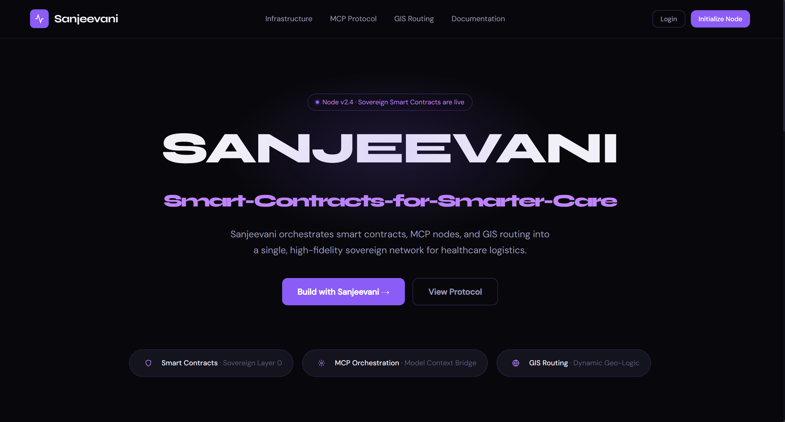
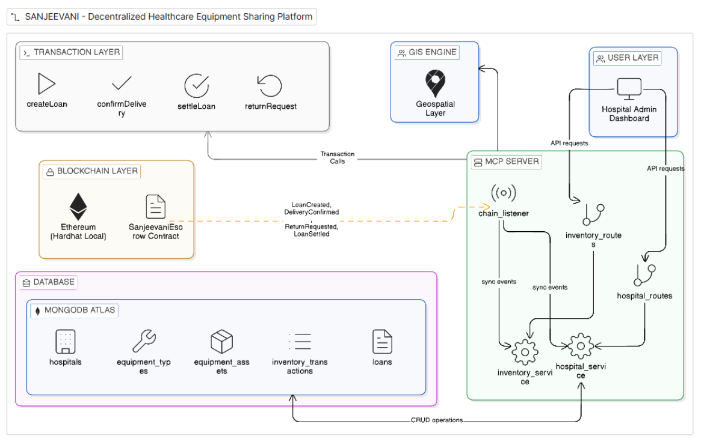
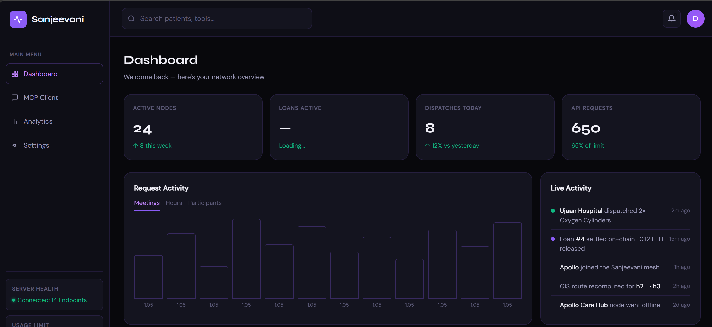
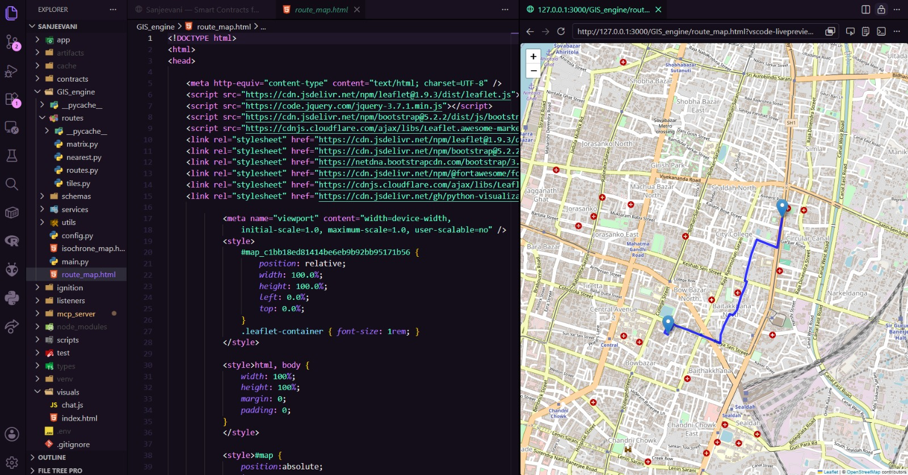

<div align="center">

# SANJEEVANI

### Smart Contracts for Smarter Care


Healthcare logistics powered by Smart Contracts, MCP Nodes, and GIS Routing.

[Features](#features) •
[Architecture](#architecture) •
[Installation](#installation) •
[Roadmap](#roadmap)

</div>

---

## Overview

Sanjeevani is a decentralized healthcare logistics platform designed to solve critical medical equipment shortages during emergencies.

Hospitals often face delays in accessing life-saving equipment due to disconnected inventory systems, manual coordination, and inefficient resource allocation.

Sanjeevani creates a trusted healthcare network where hospitals can:

- Share medical equipment securely
- Track resources in real time
- Automate lending agreements using smart contracts
- Optimize emergency dispatch using GIS routing
- Coordinate seamlessly through MCP-powered orchestration

---

## Problem Statement

Healthcare systems today suffer from:

- No real-time visibility of medical equipment across hospitals
- Manual coordination through phone calls and spreadsheets
- Delayed emergency response caused by disconnected systems
- Equipment shortages despite nearby availability
- Lack of a trusted framework for inter-hospital lending

These inefficiencies can directly impact patient outcomes during critical situations.

---

## Solution

Sanjeevani introduces a sovereign healthcare logistics network powered by:

### Smart Contracts

Automate equipment lending, borrowing, validation, and settlement between hospitals.

### MCP Orchestration

Model Context Protocol (MCP) enables seamless communication and coordination between healthcare nodes.

### GIS Routing

Provides intelligent route optimization for transporting medical equipment during emergencies.

### Real-Time Resource Visibility

Hospitals can discover available equipment across participating nodes instantly.

---

## Features

### Smart Contract Layer

- Automated equipment lending agreements
- Transparent transaction history
- Tamper-resistant audit trail
- Trustless verification

### MCP Infrastructure

- Inter-node communication
- Context-aware orchestration
- Scalable healthcare network architecture

### GIS Intelligence

- Dynamic route optimization
- Emergency dispatch planning
- Distance and ETA estimation

### Emergency Resource Exchange

- Equipment discovery
- Resource allocation
- Hospital-to-hospital collaboration

---

## System Architecture



---

## Tech Stack

### Frontend

- Next.js
- React
- TypeScript
- Tailwind CSS

### Backend

- Node.js
- Express.js

### Blockchain

- Smart Contracts
- Ethereum Compatible Networks

### GIS & Mapping

- OpenStreetMap
- Routing Engine

### Protocol Layer

- Model Context Protocol (MCP)

---

## Getting Started

### Clone Repository

```bash
git clone https://github.com/your-username/sanjeevani.git

cd sanjeevani
```

### Install Dependencies

```bash
npm install
```

### Run Development Server

```bash
npm run dev
```

Application will start at:

```bash
http://localhost:3000
```

---

## Project Structure

```text
sanjeevani/
│
├── app/
├── components/
├── public/
├── smart-contracts/
├── mcp/
├── gis/
├── docs/
│
├── package.json
└── README.md
```

---

## Future Roadmap

### Phase 1

- Real-time inventory dashboard
- Hospital onboarding

### Phase 2

- Smart contract deployment
- Automated equipment lending

### Phase 3

- GIS emergency dispatch optimization
- Predictive equipment demand forecasting

### Phase 4

- AI-powered healthcare logistics agent
- Autonomous resource allocation

---
## Screenshots

### Inventory Dashboard



### GIS Routing



---

## Potential Impact

Sanjeevani aims to create a healthcare ecosystem where critical medical equipment can be discovered, shared, and delivered rapidly during emergencies.

By combining smart contracts, intelligent routing, and interoperable healthcare infrastructure, the platform helps ensure that life-saving resources reach patients when they are needed most.

---

## Contributing

Contributions are welcome.

1. Fork the repository
2. Create a feature branch
3. Commit changes
4. Open a Pull Request

---

## License

This project is licensed under the MIT License.

---

<div align="center">

Made with ❤️ for Smarter Healthcare Infrastructure

</div>